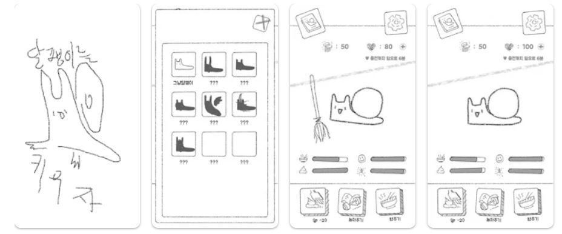
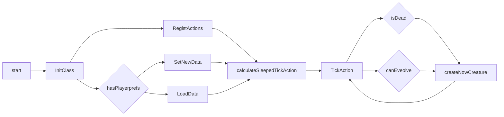
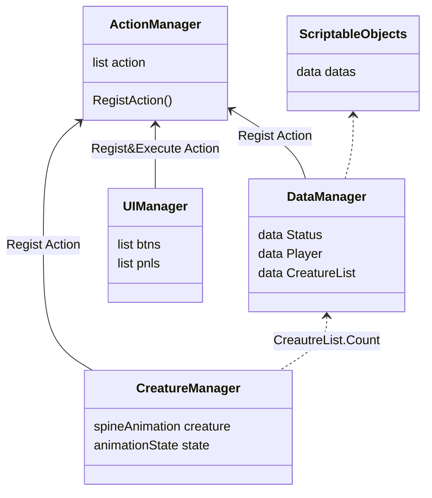

# Dalpangyeekiwoogi

## About The Project

다마고치에서 영감을 받아 제작한 키우기 게임

## Built With

- 

## Feature

체력 감소, 죽음, 진화, 밥주기, 놀아주기, 행동력 리필 등 기본 기능 구현됨

## Built With

UnityVersion : 2020.3.19f1

### Flow Chart

## Class Structure

## Update

V.0.0.1 (2020.03 ~ 04) 최초구현  
V.0.0.2 (2022.07 ~ 08) [리팩토링](https://baeknothing.tistory.com/66?category=1060113)

## Todo 

- [x] 리팩토링  
- [x] 리팩토링 정리  
- [ ] 유닛 테스트  
